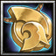

#  AnoMech

*Another FFXIV mechanics simulator*

本分支目標為繁中 Dalamud API 13（.NET 9 / C# 13），目前以本機
Dalamud 13.0.0.16 的函式庫編譯。主選單目前只顯示絕龍詩 P2 聖杖（勝仗），
使用 [tuuf／Elemental 打法](https://ffxiv.tuufless.com/elemental/dsr/02_thordan/)。
其他關卡保留原始碼，暫時從選單隱藏。

## 使用本分支

1. 依下方指令建置，在 Dalamud 設定的 Dev Plugins 新增輸出的 `AnoMech.dll` 並載入。
2. 進入旅館房間，輸入 `/ano` 或 `/anomech`。
3. 選擇職責後按「開始」。七名模擬隊友會依 tuuf 分工行動，玩家自行走位。
4. 初次練習可開啟「無敵練習」、「顯示站位提示」與「顯示戰術圖」。
5. 外圈擊退需使用親疏自行／沉穩詠唱；設定內須啟用「模擬自身技能效果」。
6. 「重置」清除本輪，「離開模擬」回到旅館。固定種子可重練同一組點名。

聖杖包含分攤劍、雙視線、騎士衝鋒、白球、冰火圈、第一輪塔、七次隕石、擊退與第二輪塔。
本關卡不包含 P2 的聖劍、後續終極結局與揮劍。
目前是可建置的練習實作，尚未完成繁中遊戲內驗收；精確時間與部分地面幾何仍需校正。
詳細設定與驗證限制見 [DSR-P2.md](DSR-P2.md)。

## 建置

安裝 .NET 9 SDK 後，在此目錄執行：

```powershell
dotnet build AnoMech.sln -c Release -p:RestoreLockedMode=true
```

會優先使用 `%APPDATA%/FFXIVSimpleLauncher/Dalamud/Injector`。其他安裝位置請設定
`DALAMUD_HOME`，或傳入 `-p:DalamudLibPath=你的繁中SDK目錄/`。
建置會檢查 Dalamud 組件版本，拒絕引用 API 14 / 15。
輸出 DLL：`AnoMech/bin/x64/Release/AnoMech.dll`；打包檔在同層 `AnoMech/` 目錄。

GitHub Actions 使用指定的繁中 API 13 SDK 壓縮檔，不下載國際服 `latest.zip`。
PR 建置需設定 repository variable `DALAMUD_API13_SDK_URL`；手動建置需輸入 SDK URL。
工作流程只產出 artifact，不再呼叫原作者的自動發布工作流程。

API 13 移植包含原生函式相容層。編譯與離線簽章匹配不代表遊戲內驗證完成。
可用 PowerShell 7 執行 `tools/Check-NativeSignatures.ps1 -GameExe <繁中ffxiv_dx11.exe路徑>`
檢查簽章匹配。遊戲內仍需在旅館載入 Dev Plugin，驗證 `/ano`、開始場景、讀條、
特效、隊友狀態、重置及離開後回復。API 13 的副本事件只支援四個 payload 參數；
新增場景若需要第五、第六個非零參數會明確拒絕派送。

---
 
Simulate FFXIV raid mechanics client-side for solo practice. Go to any Inn, open the plugin with `/anomech` and start practicing!


Thanks to improvemnts by [WorstAquaPlayer](https://github.com/WorstAquaPlayer) plugin is quite stable now! No more 
crashes after training session.

**WARNING!!!**

**You are cut off from server traffic while in the sim zone.** To keep the
fake zone stable, the plugin firewalls incoming packets from the server.  
While simulating:
  * Players joining or leaving your party will not appear in the party list
  until you leave the sim zone.
  * Ready checks will not pop.
 

### Beta: Advanced Simulation Resolution

The simulator now includes a beta feature that properly resolves most skills, triggers, and gauges during simulation. 
As this feature is still in beta, some edge cases and less common interactions may not yet resolve correctly.


## Installation

See: https://github.com/anomek/MyDalamudPlugins

## 原有關卡（本分支暫時隱藏）
- Dancing Mad (Ultimate)
    - P2 Forsaken
      - NA
        - [Kroxy-Rinon 341 (Center/N Stacks) melee adjust](https://raidplan.io/plan/UATE__aDcw1-bgVv)
        - [South Adjust 341](https://raidplan.io/plan/uq7zdjvuu7uuw8fj)
        - diamond markers or week one positions
      - EU _by [Wydox](https://github.com/Wydox)_
        - [\[LPDU\] Buddies](https://raidplan.io/plan/142oXOZpPc_jh3dd)
        - [\[Old\] p3Z Buddy Meow](https://raidplan.io/plan/lZWqxfxvyhF9sp3Z)
        - [\[Old\] zP6 South adjust](https://raidplan.io/plan/rtc1FcuZFMuyBzP6)
    - P3 Black Hole _old bh (DSA, single tethers, n/s stomps)_
    - P4 Kefka Says _kefkabin_
    - P5 Exaflares _by [Wydox](https://github.com/Wydox)_
    - P5 Celestriad _by [RoarkGit](https://github.com/RoarkGit)_
    - P5 Forsaken Null _no ai or damage_
- The Omega Protocol (Ultimate): _NA pf strats_
    - P2 Party Synergy
    - P5 Delta
    - P5 Sigma
    - P5 Omega
    - P6 Exasquares / Wave Cannon 2
- The Weapon's Refrain (Ultimate) _by [WorstAquaPlayer](https://github.com/WorstAquaPlayer)_
    - Ultimate Predaction
    - Ultimate Suppression
- The Unending Coil of Bahamut (Ultimate) _by [RoarkGit](https://github.com/RoarkGit)_
    - Exaflares

## Details

* Spawns fake party members and boss NPCs into the live game client
* Drives their positions, cast bars, tethers, and VFX so mechanics play out visually
* Your fake party members are full fledged bots that will do mechanics.  
  Some scanarios also have solo mode where you can practice without disctractions.


## How to help
1. Please provide feedback and report any issues in scenarios: bad timing, damage, config not working at it supposed
2. Bot AI currently only covers strategies from my region. Adding strategies for other regions requires little coding.
   Feel free to create pull request or contact me.
3. Adding new scenario is more involved. `tools/parser.py` generates a baseline scenario from a log, which still
   needs randomization, mechanic-failure logic and bot AI added by hand.
4. Plugin-development or reverse-engineering help, and improvement ideas, are also welcome.


## Known issues
* Minor visual and timing issues may occur
* In scenarios for Top Omega Protocol (Ultimate):
  * Tether distance threshold are very rough estimations
  * Line AOE from Optiocal Unit (eye) doesn't render
* Not all skills will resolve properly

#  Acknowledgments

Thanks for contributors:
* [WorstAquaPlayer](https://github.com/WorstAquaPlayer) - rewriting core & fixing crashes, scenarios for uwu
* [Wydox](https://github.com/Wydox) - EU strats for Forsaken, UMAD Exaflares, core improvements
* [RoarkGit](https://github.com/RoarkGit) - UMAD Celestriad, UCOB exas, win streaks

AnoMech leans heavily on the work of other Dalamud plugins. Huge thanks to their authors!  
Without them, the following would not be possible:

* **Hyperborea** — solo duty arena loading.
* **FFXIV-RaidsRewritten** — stunning the player on death and playing raid VFX.
* **bossmod** — mechanics timings and positions.
